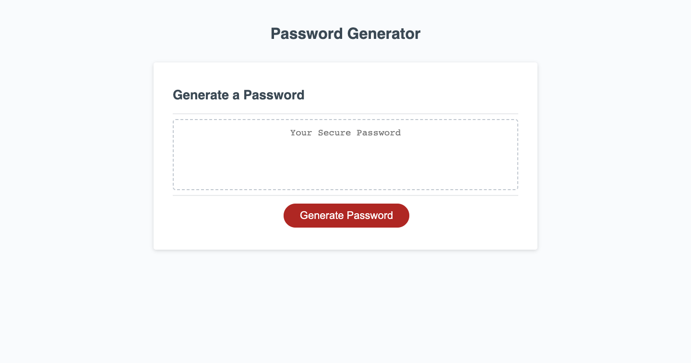

# Password Generator (Web Application)

## Description

Users can access this web application to generate a random password. Prompt and confirmation boxes will be displayed, asking for the length of the password (a minimum of 8 characters and a maximum of 128 characters) and confirming whether to include various character types (lowercase characters, uppercase characters, numeric characters, and/or special characters). Various conditional statements are used to validate the inputs/responses from the user, and a random password is generated based on the criteria that has been provided. Users can also access the underlying codebase for this web application (see Links and Usage below). 

## Links and Usage 

To access the deployed application, please visit: https://jamscc.github.io/web-app-password-generator/

Users can access the codebase in Chrome by navigating to Chrome DevTools. The codebase can also be accessed via the following link:

https://github.com/jamscc/web-app-password-generator

## Screenshot

The following is the screenshot for the web application:

